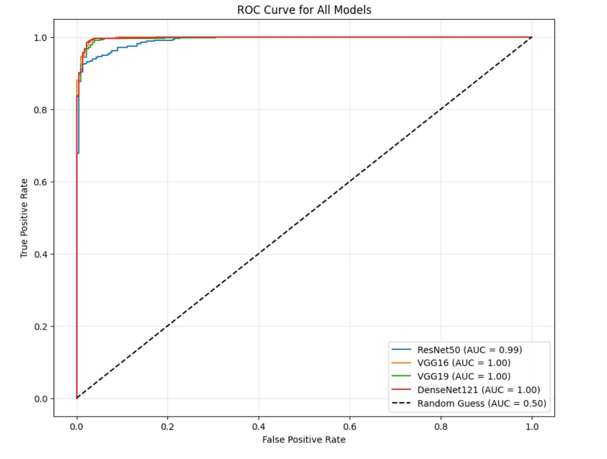
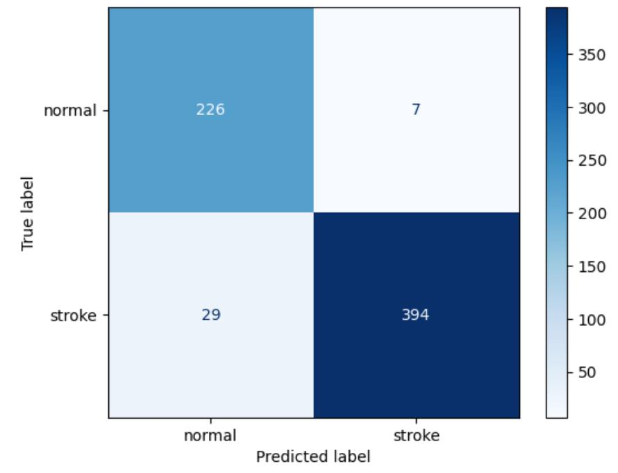

# Real-time Brain Stroke Detection using CT Scans

This project implements a deep learning-based approach for detecting brain strokes from CT scan images. Using pre-trained CNN models like **DenseNet121**, **ResNet50**, **VGG16**, and **VGG19**, we performed binary classification of CT images into **Stroke** and **Normal** categories.

---

##  Dataset
- **Source:** [Kaggle Brain Stroke CT Dataset](https://www.kaggle.com/datasets/afridimoosa/brain-stroke-dataset)
- **Total Images:** 2,501 (950 Stroke, 1,551 Normal)
- **Split:** 70% Training | 15% Validation | 15% Testing
- **Class Imbalance handled with:** Data Augmentation (Rotation, Shear, Zoom)

---

##  Model & Training
- **Best Model:** DenseNet121 (Pre-trained on ImageNet)
- **Accuracy Achieved:** 
  - **Training:** 99.77%
  - **Testing:** 98.63%
- **Optimizer:** Adam (LR = 0.0001)
- **Loss Function:** Binary Crossentropy
- **Epochs:** 25 | **Batch Size:** 64
- **Frameworks Used:** TensorFlow, Keras

---

##  Performance Metrics
| Model     | Test Accuracy | Precision | Recall | F1-Score | RMSE  |
|-----------|----------------|-----------|--------|----------|-------|
| ResNet50 | 95.73%        | 99.13%   | 98.25% | 97.00%  | 0.214 |
| VGG16    | 97.10%        | 99.80%   | 97.68% | 98.59%  | 0.132 |
| VGG19    | 98.02%        | 99.65%   | 98.10% | 97.99%  | 0.148 |
| **DenseNet121** | **98.63%** | **99.75%** | **97.91%** | **98.71%** | **0.126** |

---

##  Future Scope
- Stroke Region Localization using Segmentation
- Multi-class Stroke Type Classification (Ischemic/Hemorrhagic)
- Deployment in Real-time Clinical Systems

---

##  Authors
- **Pathan Shaheen Khan**
- **Koppuravuri Sathvik**
- **Talluri Abhinav Chowdary**
- **Neelam Vinay**
- **Guided by:** Dr. M. Srinivas (Amrita Vishwa Vidyapeetham)

---

##  Research Paper
*Real-time Brain Stroke Detection using CT Scans*  
Amrita School of Computing, Amaravati Campus

---

##  Sample Output
  

---

##  How to Run
1. Clone the repo  
   `git clone https://github.com/yourusername/brain-stroke-detection.git`
2. Install requirements  
   `pip install -r requirements.txt`
3. Run the notebook  
   Open `ConferenceCode.ipynb` in Jupyter/Kaggle  
4. Download the dataset and update the path in the code  

---

##  License
This project is for academic and research purposes only.
